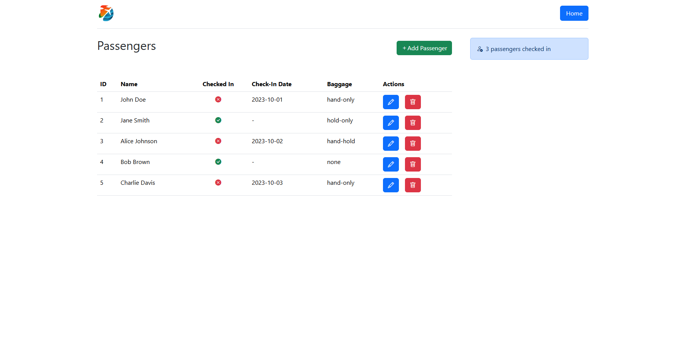
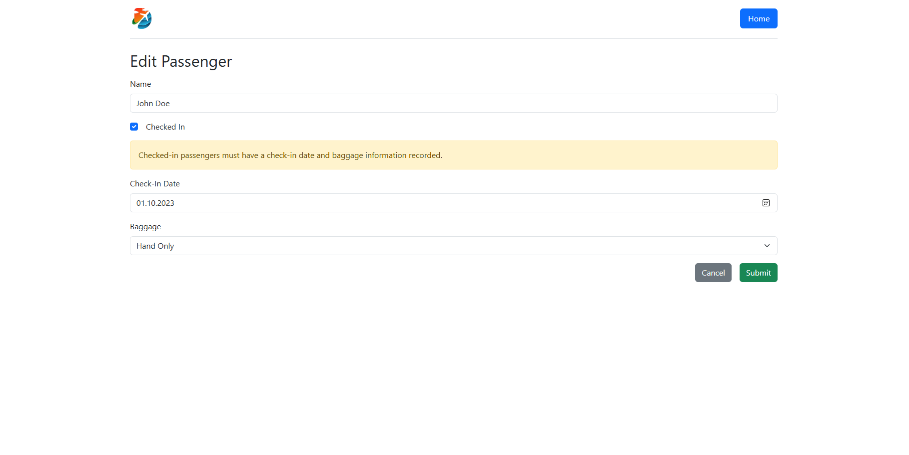

# Passengers app

## Overview

A simple app. A base for testing various React features. A minimalistic approach with only a few components. For simplicity, all values are hard-coded. I also decided to use only the `bootstrap`, `bootstrap-icons`, and `react-router-dom` libraries.

## TypeScript

I opted for explicit typings. Since this app is very simple, it consists of only two custom models: `Baggage` and `Passenger`.

## Code style

- Arrow functions are only used for callbacks.
- For simplicity, all values are hard-coded and components perform all API-related logic.

## Technologies

- React
- TypeScript
- JSON-server
- Bootstrap
- Built with Vite

## Setup

1. Clone the repository
2. Install necessary packages:

```
npm install
```

3. Run the dev server:

```
npm run dev
```

4. Run json-server:

```
npm run server
```

## Data

All data is stored in `data/db.json`. There is also `db.bak.json` if initial data is needed again.

## Demo



